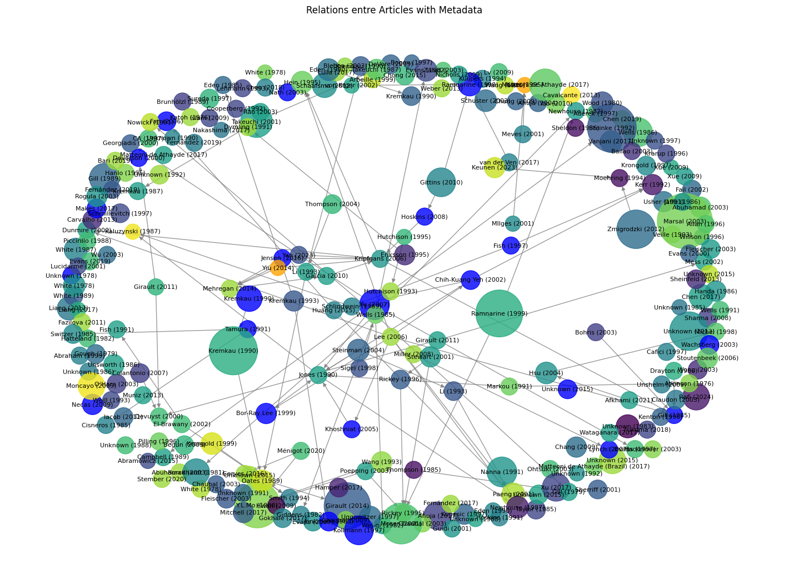

# bibliographyTree: Graph Analysis of Scientific Articles

This project facilitates the creation and analysis of a graph representing relationships between scientific articles based on keywords and journal categories. The graph is constructed using article metadata such as DOIs (article identifiers), titles, authors, publication years, and journals. Relationships between articles are derived from their bibliographic references and citations.
Objectives

## The main goals of this project are to:

- **Build a directed graph** based on scientific articles, where nodes represent articles, and edges depict relationships between them (references and citations).
- **Analyze the graph** to detect article communities, identify the most central articles using various metrics (e.g., degree centrality), and visualize these relationships.

## Features

- **Graph construction**: Using a list of DOIs and associated metadata, a graph of relationships between articles is created. Articles are linked via edges based on their citations and bibliographic references.
- **Filtering by keywords and journal categories**: The graph can be built by selecting articles based on specific keywords or journal categories.
- **Centrality analysis**: The project includes tools for analyzing article centrality within the graph, such as degree centrality, to identify the most influential articles.
- **Community detection**: Algorithms for community detection (e.g., the greedy modularity algorithm) are employed to identify groups of articles that are strongly interconnected.
- **Visualization**: The graph is visualized with nodes colored by publication year and sized proportionally to their number of connections (degree).

## Example

